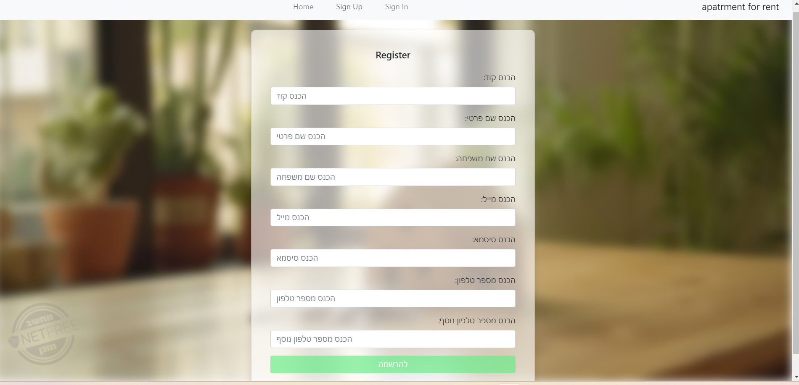
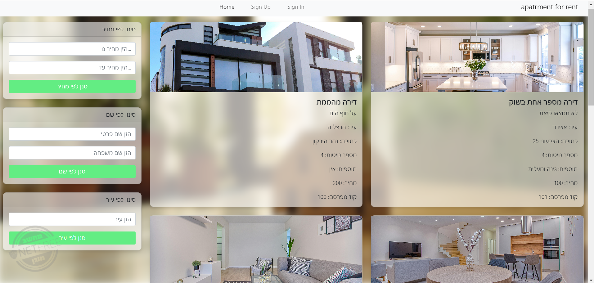
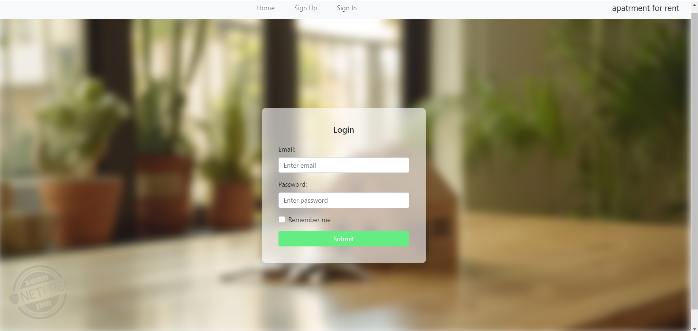

# אתר להשכרת דירות

מערכת לניהול דירות להשכרה באנגולר.

## תכונות עיקריות

- חיפוש דירה לפי קריטריונים
- טפסי התחברות והרשמה
- התחברות והרשאות

## טכנולוגיות בשימוש

- Angular
- TypeScript
- Bootstrap
- Node.js (בצד השרת)

## איך להפעיל את הפרויקט

```bash
git clone https://github.com/ElishevaAlshech/ApartmentRental
cd ApartmentRental
npm install
ng serve
ואז לפתוח דפדפן בכתובת: http://localhost:4200

תמונות מסך




